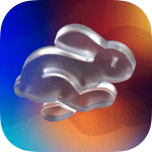

<h1> 🐰 Fluid Gradient
  
</h1>

<p>
    
    
    <a href="https://developer.apple.com/documentation/swiftui/">  </a>
    <a href="https://developer.apple.com/documentation/quartzcore">  </a>
      <a href="https://opensource.org/licenses/MIT">  </a></a>
</p>

A fluid, animated gradient implemented with CoreAnimation and SwiftUI, made available as a [Swift Package](https://developer.apple.com/documentation/xcode/adding-package-dependencies-to-your-app).


## How it works

This implementation works by displaying stacked "blobs" in a coordinate space, and blurring them afterwards to make it seem seamless. The blobs are simple `CAGradientLayer` layers added to two separate `CALayer` layers: base and highlight. The latter one has an overlay blend mode to create unique patterns. You can optionally provide colors for both the base and highlight layers.

### Why CALayer?

While it's easy to create the blob shapes in SwiftUI, animation in SwiftUI is still performed on the CPU. This means that your app will probably consume double-digit CPU percentages and be noted as a "high" energy consumer in Activity Monitor.

We use CALayer instead because it offloads all the work to the WindowServer, making your app have a zero performance impact despite running the gradient animation at full screen refresh rate.


> **Note**
> You can learn to code this project by yourself in a series of development tutorial articles written for the [Cindori Blog](https://cindori.com/developer/animated-gradient).
> - [Building a fluid gradient with CoreAnimation & SwiftUI: Part 1](https://cindori.com/developer/animated-gradient)
> - [Building a fluid gradient with CoreAnimation & SwiftUI: Part 2](https://cindori.com/developer/animated-gradient-2)

## Example usage

You can find an example buildable project that uses FluidGradient in the root of this repository (requires Xcode 14 and macOS Ventura). To use it in your app, you can start with the following:

```swift
import SwiftUI
import FluidGradient

struct ContentView: View {
    var body: some View {
        FluidGradient(blobs: [.red, .green, .blue],
                      highlights: [.yellow, .orange, .purple],
                      speed: 1.0,
                      blur: 0.75)
          .background(.quaternary)
    }
}
```

## About Cindori

[](https://cindori.com)

We're a small team of developers dedicated to crafting amazing experiences for Apple platforms.

Check out our apps and developer blog at [cindori.com](https://cindori.com).

## Contributors
- [Oskar Groth (@oskargroth)](https://github.com/oskargroth) – Founder, developer and writer
- [João Gabriel (@joogps)](https://github.com/joogps) – Team member, developer and writer

## Licensing
This project is made available through the [MIT License](https://opensource.org/licenses/MIT). 

